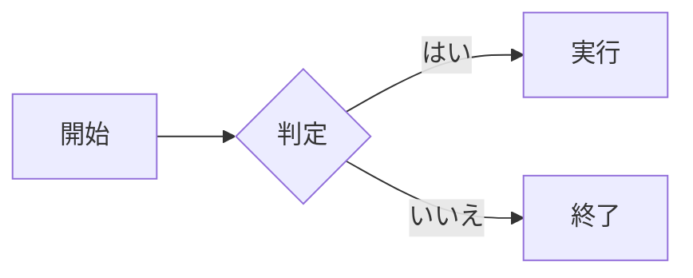

# gomdshelf

Go 製の軽量セルフホスト型ドキュメントサーバー。単一バイナリ、Markdown ベース、リアルタイムプレビュー、ダークモード、エディタ内蔵 — データベース不要。

## 特徴

- **単一バイナリ** — ビルド時に全アセットを埋め込み、どこでもデプロイ可能
- **Markdown** — GFM、シンタックスハイライト(Chroma)、タスクリスト、脚注、KaTeX 数式、Mermaid 図、Admonition
- **エディタ内蔵** — ページ全体 / セクション単位の編集、ライブプレビュー、画像ドラッグ＆ドロップ、自動下書き保存
- **ページ操作** — リネーム、コピー、削除。ディレクトリの index ページではディレクトリ単位で操作可能
- **ナビゲーション** — ドラッグ＆ドロップでサイドバー並べ替え、ディレクトリ折りたたみ、パンくずリスト
- **検索** — 全ページ横断のインスタント全文検索
- **履歴** — ページ単位のバージョン履歴、差分ビューア、ワンクリック復元、リネーム時も履歴を引き継ぎ
- **テーマ** — 4 色テーマ(青・緑・赤・黄)、ライト / ダーク / システム連動
- **モバイル対応** — レスポンシブレイアウト、ハンバーガーメニュー、スライドイン目次、統合設定パネル
- **i18n** — 英語・日本語 UI、ブラウザ言語から自動判定
- **ライブリロード** — WebSocket ベース、ファイル変更時に自動更新
- **セキュリティ** — パストラバーサル防止、画像マジックバイト検証、Basic 認証対応

## クイックスタート

### Docker(推奨)

```yaml
# compose.yaml
services:
  gomdshelf:
    build: .
    ports:
      - "8000:8000"
    volumes:
      - ./docs:/docs/src
      - ./backups:/backups
    environment:
      - SITE_NAME=My Docs
      # - TZ=Asia/Tokyo
      # - GOMDSHELF_AUTH=user:password
      # - GOMDSHELF_LANG=ja
```

```bash
docker compose up -d
```

### バイナリ

```bash
# ビルド
go build -ldflags="-s -w" -o gomdshelf .

# 実行
DOCS_DIR=./docs BACKUP_DIR=./backups SITE_NAME="My Docs" ./gomdshelf
```

http://localhost:8000 を開く

## 設定

| 環境変数         | デフォルト  | 説明                                                                 |
| ---------------- | ----------- | -------------------------------------------------------------------- |
| `DOCS_DIR`       | `/docs/src` | Markdown ファイルのディレクトリ                                      |
| `BACKUP_DIR`     | `/backups`  | バージョン履歴の保存先                                               |
| `SITE_NAME`      | `My Docs`   | ヘッダーとサイドバーに表示するサイト名                               |
| `LISTEN_ADDR`    | `:8000`     | リッスンアドレス                                                     |
| `GOMDSHELF_AUTH` | _(なし)_    | Basic 認証の資格情報(`user:password`)                                |
| `GOMDSHELF_LANG` | _(自動)_    | デフォルト UI 言語(`en` または `ja`)                                 |
| `TZ`             | `UTC`       | バックアップのタイムスタンプに使用するタイムゾーン(例: `Asia/Tokyo`) |

## ディレクトリ構成

```
docs/
├── index.md          # トップページ
├── _nav.json         # ナビゲーション順序(自動管理)
├── images/           # アップロード画像
├── guide/
│   ├── index.md      # セクションのトップ
│   └── setup.md      # /guide/setup
└── reference/
    ├── index.md
    └── api.md        # /reference/api
```

## Markdown 拡張

### Admonition

```markdown
!!! note
    これはノートです。

!!! warning "カスタムタイトル"
    カスタムタイトル付きの警告です。
```

対応タイプ: `note`, `tip`, `warning`, `danger`, `info`, `example`, `success`, `question`, `bug`

### Mermaid 図

````markdown

````

### KaTeX 数式

```markdown
インライン: $E = mc^2$

ディスプレイ:

$$
\int_{0}^{\infty} e^{-x^2} dx = \frac{\sqrt{\pi}}{2}
$$
```

## キーボードショートカット

| キー        | 操作                 |
| ----------- | -------------------- |
| `/`         | 検索にフォーカス     |
| `Ctrl+S`    | 編集中に保存         |
| `Tab`       | エディタでインデント |
| `Shift+Tab` | インデント解除       |
| `Esc`       | 検索を閉じる         |

## API

すべての API エンドポイントは JSON ベースです。

| メソッド | パス                      | 説明                                     |
| -------- | ------------------------- | ---------------------------------------- |
| GET      | `/api/content?path=`      | ページの Markdown を取得                 |
| POST     | `/api/content`            | ページの内容を保存                       |
| POST     | `/api/new`                | 新規ページ作成                           |
| POST     | `/api/rename`             | ページのリネーム                         |
| POST     | `/api/delete`             | ページの削除                             |
| POST     | `/api/copy`               | ページのコピー                           |
| POST     | `/api/rename-dir`         | ディレクトリのリネーム                   |
| POST     | `/api/delete-dir`         | ディレクトリの再帰削除                   |
| POST     | `/api/copy-dir`           | ディレクトリの再帰コピー                 |
| GET      | `/api/search?q=`          | 全文検索                                 |
| POST     | `/api/render`             | Markdown を HTML にレンダリング          |
| POST     | `/api/upload`             | 画像アップロード                         |
| GET/POST | `/api/nav`                | ナビゲーション設定の取得・更新           |
| GET      | `/api/lang?lang=`         | UI 言語の設定                            |
| POST     | `/api/backup`             | バックアップ作成                         |
| GET      | `/api/backups?filepath=`  | バックアップ一覧                         |
| GET      | `/api/backups/content`    | バックアップ内容の取得                   |
| POST     | `/api/restore`            | バックアップから復元                     |
| POST     | `/api/backups/delete`     | バックアップの削除                       |
| POST     | `/api/backups/delete-all` | ページの全バックアップを削除             |
