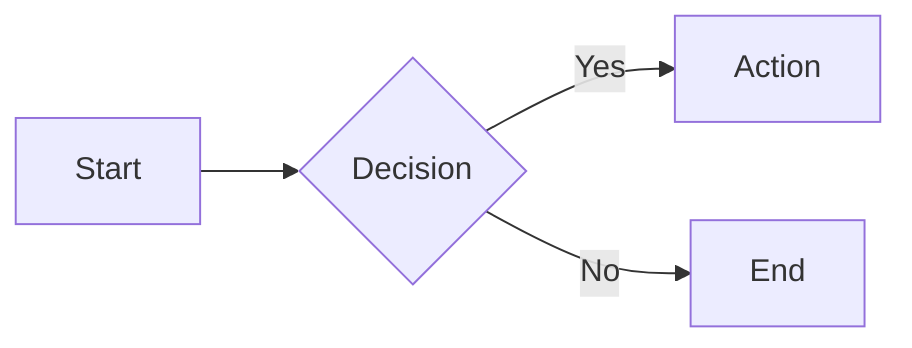

# gomdshelf

A lightweight, self-hosted documentation server built with Go. Single binary, Markdown-based, real-time preview, dark mode, and a built-in editor — no database required.

[日本語 README](README.ja.md)

## Features

- **Single binary** — embed all assets at build time, deploy anywhere
- **Markdown** — GFM, syntax highlighting (Chroma), task lists, footnotes, KaTeX math, Mermaid diagrams, admonitions
- **Built-in editor** — full-page and per-section editing with live preview, image drag & drop, auto-save drafts
- **Navigation** — drag-and-drop sidebar reordering, collapsible directories, breadcrumbs
- **Search** — instant full-text search across all pages
- **History** — per-page version history with diff viewer and one-click restore
- **Themes** — 4 color themes (blue, green, red, yellow) + dark mode
- **i18n** — English and Japanese UI, auto-detected from browser language
- **Live reload** — WebSocket-based, pages refresh on file changes
- **Security** — path traversal protection, image magic-byte validation, optional Basic auth

## Quick Start

### Docker (recommended)

```yaml
# compose.yaml
services:
  gomdshelf:
    build: .
    ports:
      - "8000:8000"
    volumes:
      - ./docs:/docs/src
      - ./backups:/backups
    environment:
      - SITE_NAME=My Docs
```

```bash
docker compose up -d
```

### Binary

```bash
# Build
go build -ldflags="-s -w" -o gomdshelf .

# Run
DOCS_DIR=./docs BACKUP_DIR=./backups SITE_NAME="My Docs" ./gomdshelf
```

Open http://localhost:8000

## Configuration

| Environment Variable | Default     | Description                                        |
| -------------------- | ----------- | -------------------------------------------------- |
| `DOCS_DIR`           | `/docs/src` | Markdown files directory                           |
| `BACKUP_DIR`         | `/backups`  | Version history storage                            |
| `SITE_NAME`          | `My Docs`   | Site name in header and sidebar                    |
| `LISTEN_ADDR`        | `:8000`     | Listen address                                     |
| `GOMDSHELF_AUTH`     | _(none)_    | Basic auth credentials (`user:password`)           |
| `GOMDSHELF_LANG`     | _(auto)_    | Default UI language (`en` or `ja`)                 |
| `TZ`                 | `UTC`       | Timezone for backup timestamps (e.g. `Asia/Tokyo`) |

## Directory Structure

```
docs/
├── index.md          # Top page
├── _nav.json         # Navigation order (auto-managed)
├── images/           # Uploaded images
├── guide/
│   ├── index.md      # Section top page
│   └── setup.md      # /guide/setup
└── reference/
    ├── index.md
    └── api.md        # /reference/api
```

## Markdown Extensions

### Admonitions

```markdown
!!! note
This is a note.

!!! warning "Custom Title"
This is a warning with a custom title.
```

Supported types: `note`, `tip`, `warning`, `danger`, `info`, `example`, `success`, `question`, `bug`

### Mermaid Diagrams

````markdown

````

### KaTeX Math

```markdown
Inline: $E = mc^2$

Display:

$$
\int_{0}^{\infty} e^{-x^2} dx = \frac{\sqrt{\pi}}{2}
$$
```

## Keyboard Shortcuts

| Key         | Action             |
| ----------- | ------------------ |
| `/`         | Focus search       |
| `Ctrl+S`    | Save while editing |
| `Tab`       | Indent in editor   |
| `Shift+Tab` | Unindent in editor |
| `Esc`       | Close search       |

## API

All API endpoints are JSON-based.

| Method   | Path                      | Description                  |
| -------- | ------------------------- | ---------------------------- |
| GET      | `/api/content?path=`      | Get page markdown            |
| POST     | `/api/content`            | Save page content            |
| POST     | `/api/new`                | Create new page              |
| POST     | `/api/rename`             | Rename page                  |
| POST     | `/api/delete`             | Delete page                  |
| GET      | `/api/search?q=`          | Full-text search             |
| POST     | `/api/render`             | Render markdown to HTML      |
| POST     | `/api/upload`             | Upload image                 |
| GET/POST | `/api/nav`                | Get/update navigation config |
| GET      | `/api/lang?lang=`         | Set UI language              |
| POST     | `/api/backup`             | Create backup                |
| GET      | `/api/backups?filepath=`  | List backups                 |
| GET      | `/api/backups/content`    | Get backup content           |
| POST     | `/api/restore`            | Restore from backup          |
| POST     | `/api/backups/delete`     | Delete a backup              |
| POST     | `/api/backups/delete-all` | Delete all backups           |
